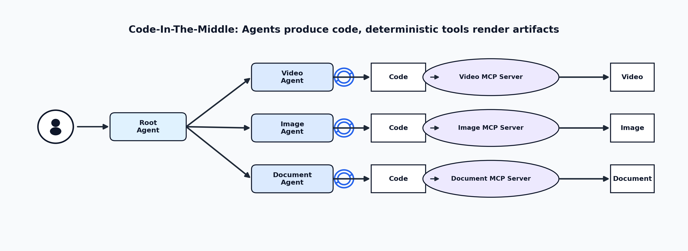

# Code-In-The-Middle 
**Code-In-The-Middle is a technique for creating editable, coherent content.**

Instead of generating content such as videos or images directly with AI, we first generate Python code that produces (renders) that content.

Instead of editing the video directly, we use AI to edit the Python code that is rendered into a video.

The code is the deterministic contract between the AI assistant and the final artifact rendering process (video, image, etc.). The code can be Python or any executable domain-specific language (DSL).

**Code-In-The-Middle** = **Prompt Engineering** + **Tools**

**Code-In-The-Middle** is not just prompt engineering to generate the DSL code; it also requires rendering tools. Some of these tools are already available in ChatGPT, but with certain limitations. These limitations can be overcome by implementing a **Code-In-the-Middle Agent**, as described below.


## Benefits

This approach has multiple benefits:

- **Coherence and determinism**  
  We can iterate many times on the content while preserving consistency across edits.

- **Control**  
  We can fine-tune or modify any aspect of the video without impacting the rest, because we modify the intermediary code.

- **Cost reduction**  
  Generating code is much cheaper than generating videos directly.

- **Explainability and debugging**  
  By using intermediary Python code (or DSL), we can clearly see how the video is generated and manually adjust specific aspects such as text, colors, or frames.
  
- **Shareable and reusable**  
  The Python code (or DSL) contract between the AI and the actual content can be shared and versioned in Git.
  
The power of this method lies in using **AI only to create and edit the DSL code, and then relying on deterministic, non-AI methods to render the actual content**.

This method came to my mind when I tried to generate some technical videos for a presentation. I used it and it really worked. I managed to generate short 15–20 second videos about Kubernetes and DevOps using ChatGPT and the prompt below.

## How It Works

You can use this prompt engineering technique (Code-In-The-Middle) directly in ChatGPT or as a standalone agent (application).

### In ChatGPT 

First, start with a prompt like:

```text
I want to create a short video (15 seconds) about Kubernetes pod autoscaling.

First, create Python code that generates the video. Use any Python libraries you prefer to generate diagrams and merge them into a short video frame by frame.

Run the code and provide the resulting video.
Verify the generated output against the specification before returning the final result.
```

After obtaining the first iteration of the video or image, we continue editing specific parts through a chatbot conversation (AI assistant):

```text
Move all the boxes a little bit to the left. And make the arrow from the user to be connected with the roto agent.
Verify the generated output against the specification before returning the final result.
```

**Verify the generated output against the specification before returning the final result** is very important because it instructs the model to visually check the result before returning it. I find this additional line very powerful in many ChatGPT conversations.


Example of Results: 
*  [https://youtu.be/NGY_J58c7nk](https://youtu.be/NGY_J58c7nk) 
*  [https://youtu.be/ZjljxOrjAFg](https://youtu.be/ZjljxOrjAFg)

[This is an example of a Python Code generated by ChatGPT to render the video](https://github.com/amihai/codeinthemiddle/blob/main/CodeInTheMiddle_example.py) 


#### Limitations

This works well in ChatGPT, but it has some limitations:

* You can generate only small videos (upt to 30 seconds)
* You can generate only what can run in the ChatGPT sandbox (what DSL is ChatGPT able to use in sandbox - like python matplotlib and moviepy).
* Sometimes you need to adapt the prompt engineering to fix rendering issues (for example you might need to suggest to ChatGPT what libraries to use for video rendering).

To overcome this limitations we have to build a small Agent or an Application.

This method works only if we have a DSL (Domain-Specific Language) for a task. For example, we already have Python libraries for generating images and videos. However, we need to develop many more DSLs so that we can generate more diverse and complex content.

## Code-In-The-Middle Agent

The agent will use this Code-In-The-Middle technique to generate videos and will overcome the limitations of ChatGPT app by:

*  Providing a rich DSL to generate more diverse and complex videos
*  Standardize the non-AI rendering part by implementing MCP servers (for each content type: video, image, document, etc).
*  Allow execution of long-running tasks so that we can generate long videos.
*  Abstract the prompt enginering and system instructions from the user.

**WORK IN PROGRESS**: The development of the agent is work in progress and can be tracked here: [Github andreimihai](https://github.com/amihai/codeinthemiddle)





# Conclusions

*  **Code-In-The-Middle** is not just a prompt engineering technique; it also includes the DSL and the deterministic rendering of that DSL into a final artifact such as a video or an image (via MCP tools).

*  The main idea behind **Code-In-The-Middle** is that **AI only creates and edits the DSL code, and the rendering of the actual content is then done through deterministic, non-AI methods**

*  Using the DSL (Python code) as a contract between the AI and the actual content makes edits **coherent**, **controllable**, **explainable**, **shareable**, and **cost-efficient**.
  
* Implementing a **Code-In-The-Middle Agent** will offer the right tools and prompt engineering for content generation of multiple binary formats like video,images,document, presentation.  


# Author

[Andrei Mihai](https://www.linkedin.com/in/andrei1985/)

