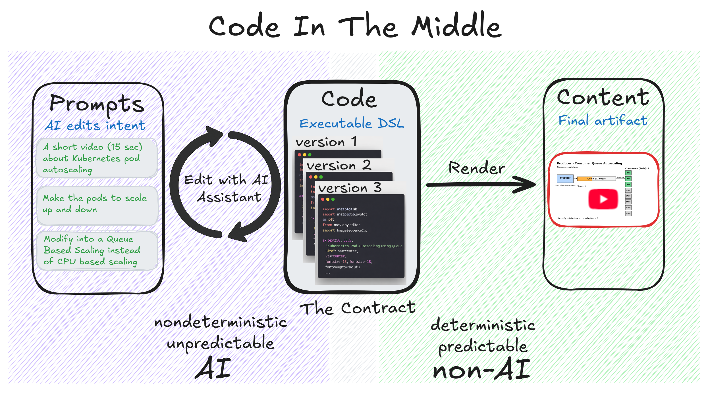

# Code-In-The-Middle 
**Code-In-The-Middle is a Prompt Engineering Technique to Create Editable, Coherent Content**

Instead of generating content such as videos or images directly with AI, we first generate Python code that produces (render) that content.

So instead of editing the video directly, we use AI to edit the Python code that will be rendered as video.

The Code is the determinitistc contract between the AI Assistant and Final Artifact rendering (video/image/etc). The Code can be Python code or any executable Domain-Specific Language (DSL).




## Benefits

This approach has multiple benefits:

- **Coherence and determinism**  
  We can iterate many times on the content editing while preserving consistency across edits.

- **Control**  
  We can fine-tune or modify any aspect of the video without impacting the rest, because we are modifying the intermediary code.

- **Cost reduction**  
  Generating code is much cheaper than generating videos directly.

- **Explainability and debugging**  
  By using intermediary Python code (or DSL), we can clearly see how the video is generated and manually adjust specific aspects such as text, colors, or frames.
  
- **Shareabale and reusable**  
  The Python code (or DSL) contract between AI and actual content can be shared and versioned in Git.
  
The power of this method lies in using **AI only to create and edit the DSL code, and then relying on deterministic, non-AI methods to render the actual content**.

This method came to my mind when I tried to generate some technical videos for a presentation. I used it and it really worked. I managed to generate short 15–20 second videos about Kubernetes and DevOps using ChatGPT and the prompt below.

## How It Works

You can use this prompt engineering techniques (Code-In-The-Middle) in ChatGPT directly or as a standalone agent (application).

### In ChatGPT 

First, start with a prompt like:

```text
I want to create a short video (15 seconds) about Kubernetes pod autoscaling.

First, create Python code that generates the video. Use any Python libraries you prefer to generate diagrams and merge them into a short video frame by frame.

Run the code and provide the resulting video.
```

After we get the first iteration of the video/image we continue editing specific parts in a Chatbot conversation mode (Ai Assistant).

Example of Results: 
*  [https://youtu.be/NGY_J58c7nk](https://youtu.be/NGY_J58c7nk) 
*  [https://youtu.be/ZjljxOrjAFg](https://youtu.be/ZjljxOrjAFg)

#### Limitations

This is working great in ChatGPT but it has some limitations:

* You can generate only small videos (upt to 30 seconds)
* You can generate only what is able to run in the ChatGPT sandbox (what DSL is ChatGPT able to use in sandbox - lke python matplotlib and moviepy).
* Sometime you need to adapt the prompt enginerring to fix some rendering bugs (for example you have to suggest to ChatGPT what libraries to use for video rendering).

To overcome this limitations we have to build a small Agent or an Application.

This method works only if we have a DSL (Domain-Specific Language) for a task. For example, we already have Python libraries for generating images and videos. However, we need to develop many more DSLs so that we can generate more diverse and complex content.

## As an AGENT (standalone Application)

The agent will use this Code-In-The-Middle technique to generate videos and will overcome the limitations of ChatGPT app by:

*  Providing a reach DSL to be able to generate more diverse and complex videos
*  Stdandardize (non-AI) the rendering part.
*  Allow execution of long running tasks so that we can generate long videos.
*  Abstract the prompt enginering and system instruction from the user.

**WORK IN PROGRESS**: The development of the agent (standalone application) is work in progress and can be tracked here: [Github andreimihai](https://github.com/amihai/codeinthemiddle)

# Conclusions

*  **Code-In-The-Middle** is not just a prompt engineering technique, because it also includes the DSL and the deterministic rendering of that DSL into a final artifact such as a video or an image.

*  The main idea behind **Code-In-The-Middle** is that **AI only creates and edits the DSL code, and the rendering of the actual content is then done through deterministic, non-AI methods**

*  Using the DSL (Python code) as a contract between the AI and the actual content makes edits **coherent**, **controllable**, **explainable**, **shareable**, and **cost-efficient**. 


# Author

[Andrei Mihai](https://www.linkedin.com/in/andrei1985/)

